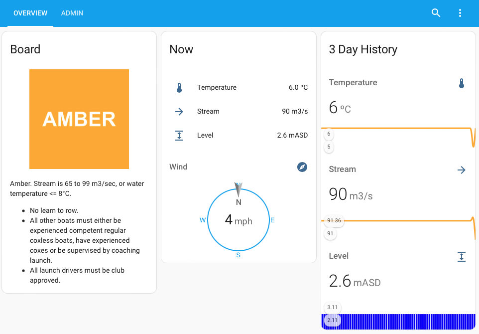

# Introduction

This Home Assistant configuration example uses weather and environment agency
data to calculate river safety status for a rowing club.



# Licence

This software is provided under the MIT licence. A copy of the licence can be
found in the same directory as this README file and both must be included with
any distribution of this software.

Rowing and river use has inherent risks and anyone using this software must
understand and manage those risks including understanding when it is not safe to use the river. As with any information source, this software may
contain bugs or flaws that could lead to it providing incorrect data so
it is not substitute for club rules, laws, risk assessment and personal
responsibility.

You must read the a companying licence and relevant rules, laws and
regulations before using this software and no information derived from this
software should be trusted without verification against another source.

You safety, and your responsibility for the safety of others must come first
at all times. You have been warned.

# Overview

The configuration and code provided uses public information sources,
local sensors, and Home Assistant to gather safety information for
the rowing club. It was originally designed for Maidenhead Rowing Club in
the UK but could be adapted for any similar rowing club or other river uses.

The safety assessment is based on environmental conditions (e.g.
temperature and river flow rate, aka "stream") which sets a colour status.
At Maidenhead Rowing Club  this is know know as a "board", owing to the
physical board used to show the colour at the club; in other clubs it is known as a "flag".

# Maidenhead RC Rules

The board colours at Maidenhead Rowing Club are based on on the following rules.

#### Board Colour: Amber
Criteria:
- **Stream:** 65 to 99 m3/sec
- **Water Temperature** 3°C to 8°C

Rules:
- No learn to row.
- All other boats must either be experienced competent regular coxless  boats, have experienced coxes or be supervised by coaching launch.
- All launch drivers must be club approved.

#### Board Colour: Red/Amber
Criteria:
- **Stream:** 100 to 119 m3/sec
- **Water Temperature** less than 3°C

Rules:
- Only experienced crews and regular scullers with captains, safety adviser's or senior coach's permission.
- Advanced and high performance junior squads may row if approved by their coach, who is responsible for the decision.
- Coxed boats must have experienced coxes or experienced steers person.
- No novice rowing or sculling.
- Launch and experienced coach to accompany crews/squads.
- All launch drivers must be club approved.

#### Board Colour: Red
Criteria:
- **Stream:** >= 120 m3/sec
- **Fog:** less than 400m visibility (Clubhouse to Regatta Steps).
- Lightning, storm, high winds or any other severe weather.

Rules:
- No rowing

#### Further information

- Website ([🔗 here](https://www.maidenheadrc.org.uk)).
- Safety Plan and Safety Rules ([🔗 here](https://www.maidenheadrc.org.uk/images/SAFETY/Maidenhead-Rowing-Club-Safety-Plan-and-Rules-0618-1.1.pdf))
- Location ([🔗 here](https://www.google.com/maps/place/Maidenhead+Rowing+Club/@51.5234881,-0.7209902,13.84z/ata=!4m5!3m4!1s0x4876632f7d97dcd3:0xdad84e45d3d6b077!8m2!3d51.5231998!4d-0.701168)).

# How it works

1. **Wind speed/direction** and **air temperature** is obtained from the met office Datapoint API.
2. **River level** and **flow**, aka **stream**, is obtained from the environment agency API.
3. Additional inputs could be taken from local sensors such as water temperature.
4. Home assistant collects this data every 15 to 60 minuets depending on the API spec.
5. When the input data changes a Home Assistant automation is trigged to update the board colour and it provides a reason text to help understand why the colour was selected.
6. Board colour can be overridden manually. This is for situations where the board colour cannot be calculated based on rules (e.g. fog, lightening, wind, other local conditions) or the calculation does not give the desired board colour. Once overridden the board colour will stay manually controlled until the override is turned off.

# Dependencies

- A Working Home Assistant instance ([🔗 here](https://www.home-assistant.io)).
- Custom cards for the Lovelace user interface.
  - vertical-stack-in-card ([🔗 here](https://github.com/ofekashery/vertical-stack-in-card)).
  - mini-graph-card ([🔗 here](https://github.com/kalkih/mini-graph-card)).
  - compass-card ([🔗 here](https://github.com/tomvanswam/compass-card)).

# Installation

#### Step 1 - Dependencies
Install dependencies listed above. The custom cards can be installed manually or using HACCS ([🔗 here](https://hacs.xyz)).

#### Step 2 - Code and config
Copy the contents of this repository to your Home Assistant config directory. This will add the following files:

```bash
./rowing_club
./rowing_club/LICENSE
./rowing_club/automations.yaml
./rowing_club/DEVELOPERS.md
./rowing_club/README.md
./rowing_club/configuration.yaml
./www/rowing_club
./www/rowing_club/board_red_amber.png
./www/rowing_club/board_red.png
./www/rowing_club/board_amber.png
./www/rowing_club/board_none.png
```

Add the rowing_club ```package.yaml``` to your ```configuration.yaml``` file.

For example:

```yaml
homeassistant:
  packages:
    rowing_club: !include rowing_club/package.yaml
```
#### Step 3 - Create a dashboard

Create a new dashboard in home assistant ([🔗 here](https://my.home-assistant.io/redirect/lovelace_dashboards/)) and give it a suitable namo. Navigate to it and select "Edit Dashboard" from the `⋮` menu. From the next `⋮` menu choose the `{} Raw Configuration Editor`. Finally paste in the contents of `dashboard.yaml` and save.

#### Step 4 - Configure the APIs

Go to the dashboard and the API settings card.

1. **Met Office DataPoint API Key**
   - Follow the instructions to register and get your DataPoint API key ([🔗 here](https://www.metoffice.gov.uk/services/data/datapoint))
   - Enter it in the `met_datapoint_api_key` field.
2. **Met Office Location**
   - Select a Met Office location, AKA site, code.
   - A Google map of locations, generated December 2022, is avilable (🔗 [here](https://www.google.com/maps/d/u/0/edit?mid=1BW6GgAFP3UwhLppKCnk37rGU7O9vjZg&usp=sharing))
   - Alternatively the latest list of locations can obtained from the Datapoint "UK observations site list feed" API (🔗 [here](https://www.metoffice.gov.uk/services/data/datapoint/uk-locations-site-list-detailed-documentation)).
   - Enter it in the `met_datapoint_location` field.
3. **Environment Agency Station**
   - Select an Environment Agency station code.
   - A Google map of stations, generated December 2022, is avilable (🔗 [here](https://www.google.com/maps/d/u/0/edit?mid=1EUGAwt8jtlTgiMnaoaqtW9WDagp4rCY&usp=sharing))
   - Alternatively the latest list of stations can obtained from the environment agency API (🔗 [here](http://environment.data.gov.uk/flood-monitoring/id/stations )).
   - Enter it in the `env_station` field.

#### Step 5 - Shouldn't be needed!

Everything should now be in place but if you notice entities unavailable in the dashboard it may be because the required data has not yet been gathered from the APIs or sensors yet. To fix that go to the admin tab of the dashboard, find the link to the `update_env_and_met_data` script and click `run`

# What next?

#### Customise the dashboard
The dashboard is just a starter - change it as much you you like!

#### Customise the rules
Edit `automations.yaml` or if you would prefer to use the UI disable "Rowing Club Board Change" Automation (🔗 [here](https://my.home-assistant.io/redirect/automations/)), duplicate it, make your changes, and save.
